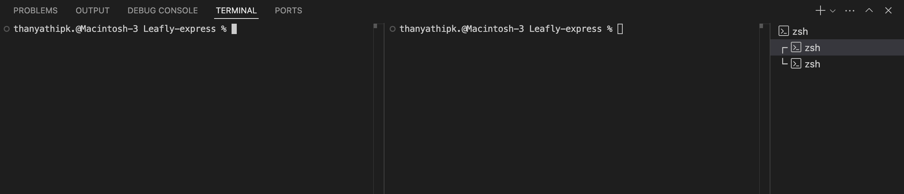
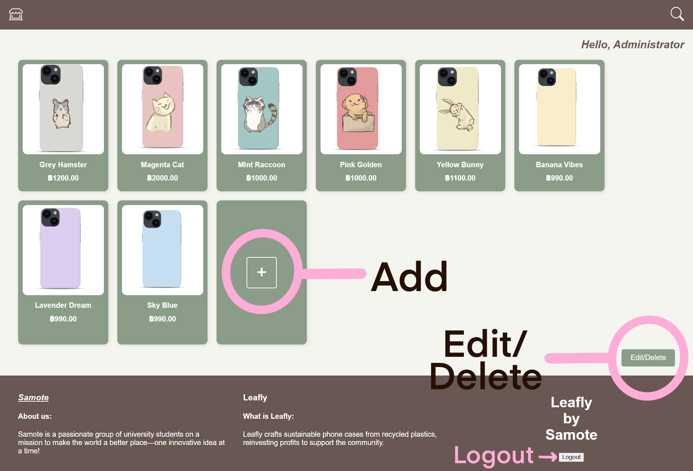
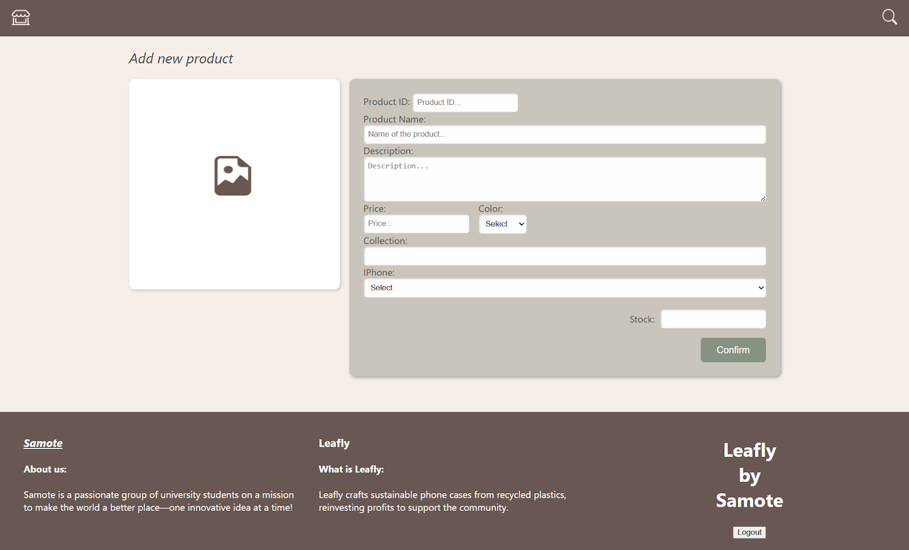
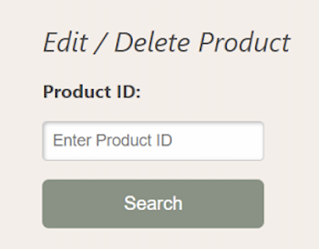
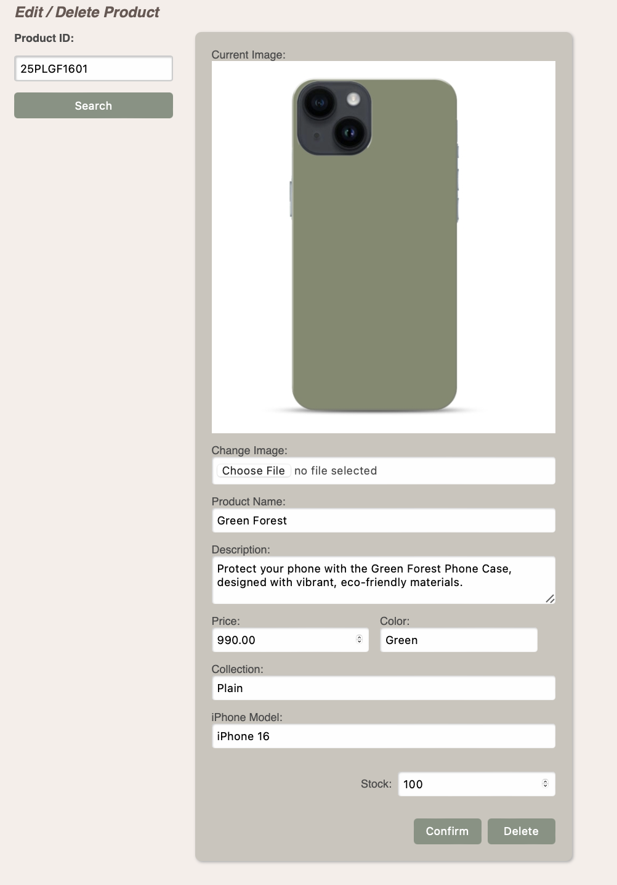

# Leafly Online Shopping Web Application

This project is developed for **ITCS223: Introduction to Web Development**.  
Our website focuses on selling high-quality phone cases through an easy-to-use online shopping platform.

---

## Database Setup

1. **Download and Run Database Script:**
   - Download the file `sec3_gr4_database.sql`.
   - Import and Execute it in your MySQL Server to create a database called `sec3_gr4_database`.

2. **Create MySQL User:**
   - Username: `Samote`
   - Authentication Type: `caching_sha2_password`
   - Password: `Hellosamote1234***`
   - Host: `localhost`
   - Account Limits:
   - Max. Queries: 0
   - Max. Updates: 100
   - Max. Connections: 100
   - Concurrent Connections: 100
   - Set privileges on `sec3_gr4_database`: `SELECT`, `INSERT`, `UPDATE`, `DELETE`

3. **Test the Database:**
   - Run SQL command:
     ```sql
     USE sec3_gr4_database;
     SELECT * FROM Admin_Info;
     ```
   - It should return **10 rows**.

---

## Project Setup

1. **Create a Project Folder:**
   - Create a folder named `Leafly-express`.

2. **Download Front-End and Back-End Folders:**
   - From GitHub, download:
     - `sec3_gr4_fe_src` (front-end code)
     - `sec3_gr4_ws_src` (back-end code)
   - Place both folders inside `Leafly-express`.

3. **Folder Structure:**
   ```
   Leafly-express (root)
   ├── sec3_gr4_fe_src
   │   ├── css
   │   ├── html
   │   ├── images
   │   ├── js
   │   └── Front-End.js
   └── sec3_gr4_ws_src
       └── Back-End.js
   ```

---

## Running the Website

1. **Open VS Code and Open Folder `Leafly-express`.**

2. **Create `.env` File in `sec3_gr4_ws_src`:**
   ```bash
   DB_HOST=localhost
   DB_USER=Samote
   DB_PASSWORD=Hellosamote1234***
   DB_NAME=sec3_gr4_database
   ```

3. **Split Terminal:**
   

4. **First Terminal (Front-End Setup):**
   ```bash
   cd sec3_gr4_fe_src
   npm init
   npm install nodemon
   npm install express http-proxy-middleware
   ```

   - Edit `package.json`:
     ```json
     "scripts": {
       "start": "node Front-End.js"
     }
     ```

5. **Second Terminal (Back-End Setup):**
   ```bash
   cd sec3_gr4_ws_src
   npm init
   npm install nodemon
   npm install express cors dotenv mysql2 multer express-session express-mysql-session body-parser
   ```

   - Edit `package.json`:
     ```json
     "scripts": {
       "start": "node Back-End.js"
     }
     ```

6. **Folder Structure:**
   ```
   Leafly-express (root)
   ├── sec3_gr4_fe_src
   │   ├── css
   │   ├── html
   │   ├── images
   │   ├── js
   │   ├── node_modules
   │   ├── package-lock.json
   │   ├── package.json
   │   └── Front-End.js
   └── sec3_gr4_ws_src
       ├── node_modules
       ├── .env
       ├── package-lock.json
       ├── package.json
       └── Back-End.js
   ```

7. **Start Both Servers:**
   - On **both terminals**, type:
     ```bash
     npm start
     ```
     - The **front-end server** will run on **Port 3000**.
     - The **back-end server** will run on **Port 4000**.

---

## Open the Website

- Open your browser and go to:  
  [http://localhost:3000/](http://localhost:3000/)

---

## How to Use the Website

### Customer Pages:
- **Home Page**  
  - Shows our best-selling products and you can view our physical Leafly warehouse on the map below.  
  [http://localhost:3000/home](http://localhost:3000/home)

- **Team Page**  
  - Shows information about each team member, including their social media links in _**contact**_.. 
  [http://localhost:3000/team](http://localhost:3000/team)

- **Search Page**  
- You can browse all products without any search criteria, or use the advanced search to filter results. Click on any product to view its details.
- Example: Keyword – `golden`
  [http://localhost:3000/search](http://localhost:3000/search)

---

### Admin Page:
- **Login Page**  
  [http://localhost:3000/login](http://localhost:3000/login)

  - Admin ID: `AD67093`
  - Password: `Mantrajennie444`
  - **Important**: Don't forget to check "**I am not a robot**" before logging in.

---

### Admin Features:



- **Add Product**  
  [http://localhost:3000/add-page](http://localhost:3000/add-page)
  
  - Click "**Add**" card to add a new product.
  - Example Product Details:
    - Image : **You can find it in the "Example-Leafly" folder in Github**
    - Product ID: `25PLGF1601`
    - Product Name: `Green Forest`
    - Description: `Protect your phone with the Green Forest Phone Case, designed with vibrant, eco-friendly materials.`
    - Price: `990`
    - Color: `Green`
    - Collection: `Plain`
    - iPhone Model: `iPhone 16`
    - Stock: `100`


- **Edit Product**  
  [http://localhost:3000/delete-edit-page](http://localhost:3000/delete-edit-page)
  - Input Product ID: `25PLGF1601`, click **Search**.
  - 
  - You can odify any product details (e.g., change image, stock, price) then click **Confirm**.
  - Example Product Name: `Matcha Greentea`
  - 
- **Delete Product**  
  - Same as Edit, but click **Delete** to remove the product.

- **Logout**  
  - Click **Logout** on the bottom-right of Admin, Add, or Edit-Delete page.

---

## Notes

- Admin session will expire after **3 hours**.
- Make sure MySQL Server is running before starting the backend server.
- Some browsers may block cookies when frontend and backend are on different ports allow cookies manually if needed.

---

## Project By

- Section 3 - Group 4  
- 6688038 Chanikarn Kaewkomut  
- 6688049 Thanyatip Korapintavangkul  
- 6688071 Ornrumpa Nirundorn  
- 6688117 Thanyarat Suksuwan  
- 6688120 Pannatorn Suyaoei
